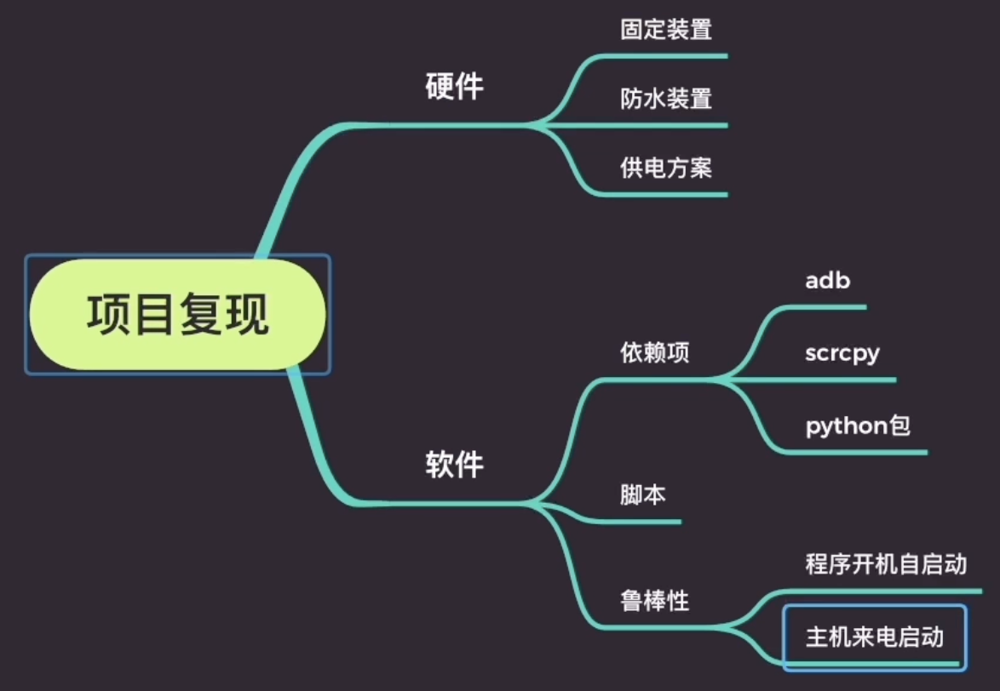

# pyTimelapse

## Abstract

* An Extra-long Timelapse Solution Using Python and ADB

* Overview

  

## Installing Dependencies

1. Android Debug Bridge: https://developer.android.google.cn/studio/releases/platform-tools
2. scrcpy: https://github.com/Genymobile/scrcpy
3. Python packages: use pip to install whatever is missing

## Usage

1. Main function: `python3 timelapse.py`
   * This file is highly mobile-device dependent
   * Please read through the code and customize it according to your needs before you put it into work 
     * `OS_is_win`
     * Coordinates of `adb shell input tap`
     * Paths of files
     * ...
2. Select & copy files: refer to `copyfiles.py`
   * You may need to configure paths before it can work properly

## Auto Startup Scripts

1. `start.sh` is for linux/macos and `start_win.bat` is for windows
2. Specify values of `<IP>` and `<REPO PATH>` in these files
3. Add the execution of the script to your OS startup application list
4. In BIOS settings, set your computer to "reboot after a power failure"
   * windows users may find autologon helpful: https://docs.microsoft.com/zh-cn/sysinternals/downloads/autologon

